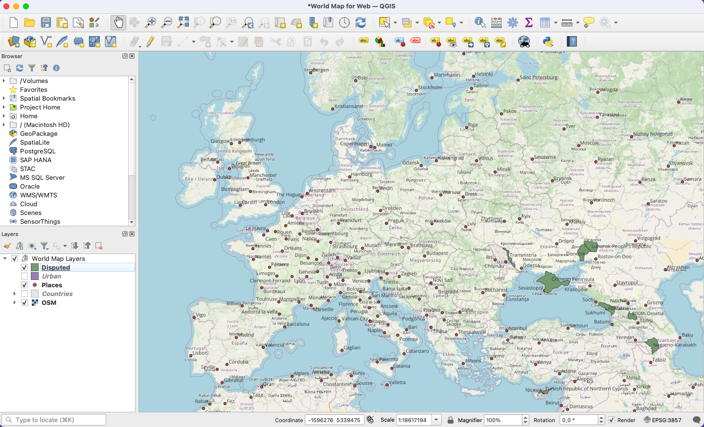
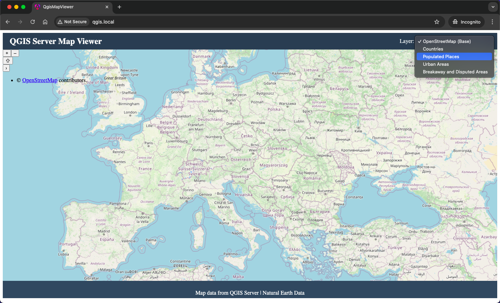
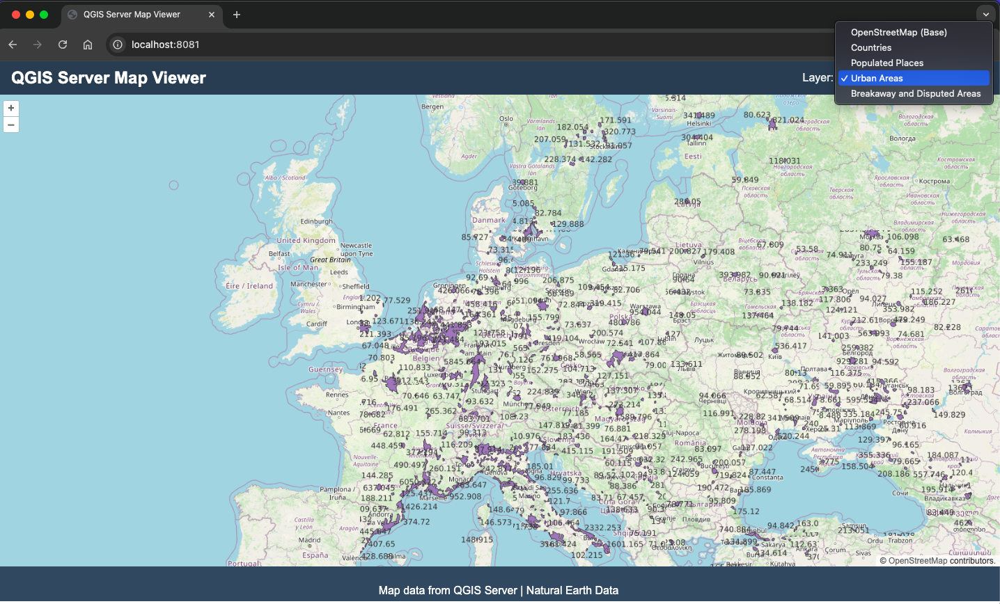

# QGIS Web Mapping

## Overview

This project provides multiple deployment methods for a QGIS Server-based web mapping application. It offers flexible options to deploy both the server backend and various client applications, allowing users to select the approach that best fits their infrastructure and complexity requirements.



The project consists of:
- A QGIS Server backend to serve geospatial data via WMS
- Multiple frontend implementations (Angular and simple HTML/JS)
- Multiple deployment methods (Kubernetes and Docker Compose)

## Project Structure

| Directory | Purpose |
|-----------|---------|
| projects | QGIS project files (`.qgs`) and related styling/templates |
| data | Geographic data files (Natural Earth shapefiles) |
| deployment-k8s | Kubernetes deployment configurations and scripts |
| deployment-docker | Docker Compose deployment configurations |
| frontend-angular | Angular-based web mapping application |
| frontend-simple | Simple HTML/JS/CSS web mapping application |
| config | Configuration files used across deployments |

## Available Deployment Methods

### 1. Kubernetes with Angular Frontend



Deploys both QGIS Server and a sophisticated Angular-based web mapping client in a Kubernetes cluster.

**Key Characteristics:**
- Full-featured reactive UI using Angular
- Containerized deployment of both backend and frontend
- More sophisticated UI capabilities
- Better code organization for complex features
- Uses pre-built Docker images

### 2. Kubernetes with Simple Frontend



Deploys QGIS Server alongside a lightweight HTML/JS/CSS web client in a Kubernetes cluster.

**Key Characteristics:**
- Uses ConfigMaps to deploy the frontend directly
- Same QGIS Server configuration as the Angular option
- Simpler implementation with vanilla JavaScript
- No need to build Docker images for the frontend
- Easier to make quick changes to the frontend

### 3. Docker Compose with Simple Frontend

Deploys both QGIS Server and the lightweight web client using Docker Compose.

**Key Characteristics:**
- Simplest deployment option
- Suitable for local development or simple production environments
- No Kubernetes requirements
- Uses the same frontend as the "Kubernetes Simple" option
- Configured entirely through Docker Compose

## Deployment Instructions

### 1. Kubernetes with Angular Frontend

```bash
cd deployment-k8s
./deploy.sh
```

This script:
1. Creates namespace `qgis-system` in your Kubernetes cluster
2. Checks and installs ingress-nginx controller if needed
3. Creates ConfigMaps for NGINX config, entrypoint script, etc.
4. Creates ConfigMap from the QGIS project file
5. Deploys QGIS Server using the specified Docker image
6. Deploys Angular viewer using its Docker image
7. Applies services and ingress configurations
8. Waits for pods to be ready

The deployment can be accessed at `http://qgis.local/` once complete.

### 2. Kubernetes with Simple Frontend

```bash
cd deployment-k8s
./deploy.simple.sh
```

This script:
1. Creates namespace `qgis-system` in your Kubernetes cluster
2. Checks and installs ingress-nginx controller if needed
3. Creates ConfigMaps for NGINX config, entrypoint script, etc.
4. Creates ConfigMap from the QGIS project file
5. Creates ConfigMaps from the HTML, JS, and CSS files in frontend-simple
6. Deploys QGIS Server using the specified Docker image
7. Deploys viewer using deployment.simple.yaml that mounts the ConfigMaps
8. Applies services and ingress configurations
9. Waits for pods to be ready

The deployment can be accessed at `http://qgis.local/` once complete.

### 3. Docker Compose with Simple Frontend

```bash
cd deployment-docker
docker compose up -d
```

This command:
1. Starts the QGIS Server container with appropriate environment variables
2. Mounts volumes for projects and data
3. Sets up an Apache container to serve the simple frontend
4. Configures network connections between services

The deployment can be accessed at:
- Frontend: `http://localhost:8081/`
- QGIS Server direct access: `http://localhost:8080/qgis/qgis_mapserv.fcgi`

## Host Configuration for Local Development

When using the Kubernetes deployments, you'll need to configure your local system to resolve `qgis.local` to your machine. This is done by modifying your hosts file:

- **Linux/Mac users**: Edit `/etc/hosts` with sudo privileges:
  ```bash
  sudo nano /etc/hosts
  ```
  Add the following line: `127.0.0.1 qgis.local`

- **Windows users**: Edit `C:\Windows\System32\drivers\etc\hosts` with administrative privileges:
  1. Open Notepad as Administrator
  2. Open the file at `C:\Windows\System32\drivers\etc\hosts`
  3. Add the following line: `127.0.0.1 qgis.local`

Once configured, you can access the application at `http://qgis.local/` in your browser after deployment.

## Frontend Applications

### Angular Frontend (frontend-angular)

A sophisticated web mapping application built using Angular.

**Features:**
- Reactive UI updates through Angular signals
- Component-based architecture
- Modern build pipeline with Angular CLI
- TypeScript for improved code safety and tooling
- Advanced state management capabilities

### Simple Frontend (frontend-simple)

A lightweight web mapping application built using vanilla JavaScript, HTML, and CSS.

**Features:**
- Minimal dependencies
- Simple codebase
- Easy to modify and extend
- Direct inclusion in deployments via ConfigMaps (K8s) or volume mounts (Docker Compose)
- OpenLayers for map rendering

## Configuration Options

### QGIS Server Environment Variables

| Variable | Description | Default |
|----------|-------------|---------|
| `QGIS_PROJECT_FILE` | Path to the QGIS project file | `/etc/qgisserver/world_map.qgs` |
| `QGIS_SERVER_LOG_LEVEL` | Logging verbosity (0-3) | `2` |
| `QGIS_SERVER_ENABLE_GETMAP` | Enable GetMap requests | `true` |
| `QGIS_SERVER_TRUST_LAYER_METADATA` | Trust layer metadata | `true` |
| `QGIS_SERVER_WMS_ENABLED` | Enable WMS service | `true` |
| `QGIS_SERVER_ALLOW_GETMAP` | Allow GetMap requests | `true` |
| `QGIS_SERVER_IGNORE_BAD_LAYERS` | Ignore problematic layers | `true` |

### NGINX Configuration

The QGIS Server container runs with an NGINX server configured to proxy requests to the QGIS Fast CGI application:

```nginx
location ~ ^/qgis/qgis_mapserv\.fcgi {
    include fastcgi_params;
    fastcgi_pass unix:/var/run/fcgiwrap.socket;
    fastcgi_param SCRIPT_FILENAME /usr/lib/cgi-bin/qgis_mapserv.fcgi;
    
    # QGIS Server configurations
    fastcgi_param QGIS_PROJECT_FILE /etc/qgisserver/world_map.qgs;
    fastcgi_param QGIS_SERVER_LOG_LEVEL 2;
    fastcgi_param QGIS_DEBUG 1;
    
    # Further configuration...
}
```

### Apache Proxy Configuration

In the Docker Compose deployment, Apache proxies requests to the QGIS Server:

```apache
<IfModule mod_proxy.c>
    ProxyRequests Off
    ProxyPreserveHost On
    
    ProxyPass "/qgis/qgis_mapserv.fcgi" "http://qgis-server:80/qgis/qgis_mapserv.fcgi?"
    ProxyPassReverse "/qgis/qgis_mapserv.fcgi" "http://qgis-server:80/qgis/qgis_mapserv.fcgi"
</IfModule>
```

## Layer Configuration

The project includes several map layers from Natural Earth data:

| Layer | Description | Short Name |
|-------|-------------|------------|
| Countries | World countries | Countries |
| Places | Populated places | Places |
| Urban Areas | Urban areas | Urban |
| Disputed Areas | Disputed territories | Disputed |

These are defined in the QGIS project file (`world_map.qgs`) and can be selected from the dropdown in the web interface.

## Comparison of Deployment Methods

| Feature | K8s Angular | K8s Simple | Docker Compose |
|---------|------------|------------|---------------|
| **Frontend** | Angular | HTML/JS | HTML/JS |
| **Backend** | QGIS Server | QGIS Server | QGIS Server |
| **Complexity** | Highest | Medium | Lowest |
| **Infrastructure Required** | Kubernetes cluster | Kubernetes cluster | Docker only |
| **Frontend Packaging** | Docker image | ConfigMaps | Volume mounts |
| **Development Experience** | Angular workflow | Simple file edits | Simple file edits |
| **Scaling Capabilities** | High | Medium | Limited |
| **Update Process** | Rebuild image | Update ConfigMaps | Update files |
| **URL Structure** | `http://qgis.local/` | `http://qgis.local/` | `http://localhost:8081/` |

## Common Issues and Troubleshooting

### Docker Compose Deployment

1. **Proxy Error 500**
   - Ensure the question mark is present in the Apache proxy configuration
   - Check that all QGIS Server environment variables are properly set
   - Verify the data paths in the QGIS project file

2. **NGINX Configuration Errors**
   - If you see "Device or resource busy" errors, ensure volumes are properly mounted
   - Check that nginx-qgis.conf is properly configured and accessible

### Kubernetes Deployments

1. **Pod Startup Issues**
   - Check pod logs: `kubectl logs -n qgis-system <pod-name>`
   - Verify ConfigMap contents: `kubectl describe configmap -n qgis-system <configmap-name>`

2. **Ingress Issues**
   - Ensure ingress-nginx controller is running
   - Verify `qgis.local` is in your /etc/hosts file pointing to 127.0.0.1

## License
[MIT](./LICENSE)
